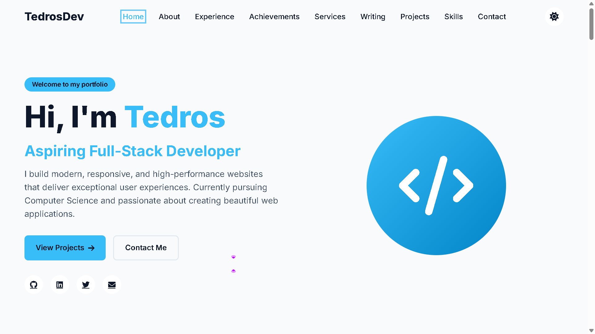
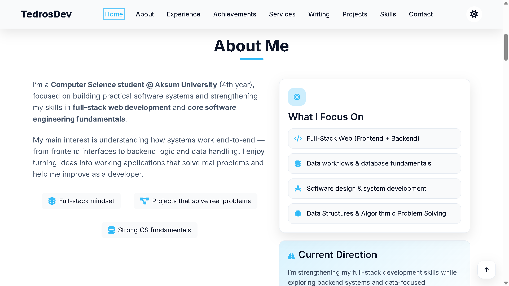
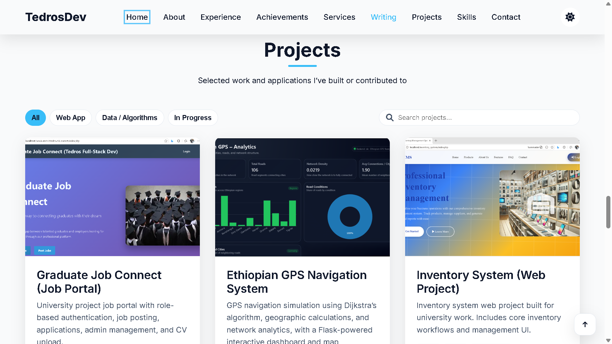
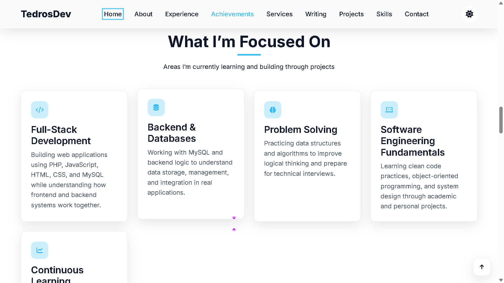

# Tedros Portfolio

This is a **personal portfolio website** built with **HTML, CSS, and JavaScript**, featuring a responsive design, interactive user interface, and a small **Python automation tool** that synchronizes the Projects section with GitHub repositories.

## 📸 Screenshots

### 🏠 Home (Hero Section)



### 👨‍💻 About Me



### 🚀 Projects



### 💻 Technical Skills



---

## 🚀 Run Locally

Open `index.html` in your preferred web browser.

Or use a local development server if desired.

---

## 📂 Project Structure

```
portfolio/
│── screenshots/
│   ├── hero.png
│   ├── about.png
│   ├── projects.png
│   └── skills.png
│
│── data/
│   └── projects.json
│
│── tools/
│   └── update_projects.py
│
│── index.html
│── style.css
│── script.js
│── sitemap.xml
│── README.md
```

---

## 🛠 Technologies Used

* HTML5
* CSS3
* JavaScript
* Python
* Git & GitHub
* Netlify

---

## 📬 Contact

**Tedros Weldegebriel**

* GitHub: <https://github.com/tedrosweldegebriel465-eng>
* LinkedIn: <https://www.linkedin.com/in/tedros-dev369/>
* Email: [tedrosweldegebriel465@gmail.com](mailto:tedrosweldegebriel465@gmail.com)
